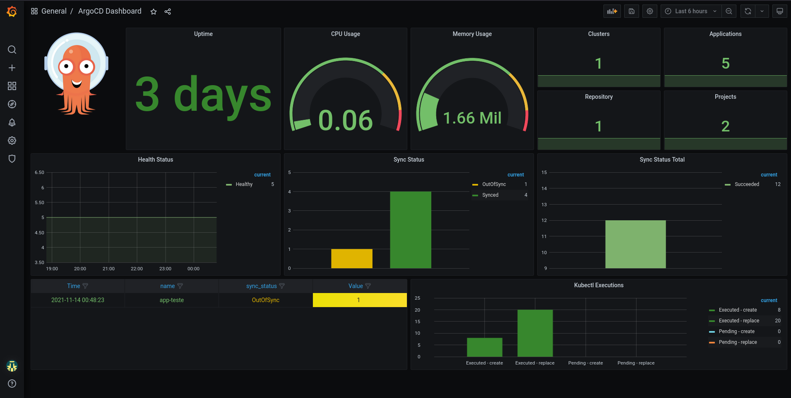

# ARGOCD

```
.
├── base
│   ├── ingress
│   │   ├── ingress.yaml
│   │   └── kustomization.yaml
│   ├── logging
│   │   └── kustomization.yaml
│   ├── machines
│   │   ├── infra
│   │   │   ├── kustomization.yaml
│   │   │   └── mcp.yaml
│   │   ├── kustomization.yaml
│   │   └── machineset.yaml
│   ├── monitoring
│   │   ├── kustomization.yaml
│   │   └── monitoring-config.yaml
│   └── registry
│       ├── imageregistry.yaml
│       └── kustomization.yaml
├── overlays
│   ├── dev
│   │   └── kustomization.yaml
│   ├── infra
│   │   ├── kustomization.yaml
│   │   ├── patch-hw.yaml
│   │   ├── patch-replicas.yaml
│   │   ├── patch-roles.yaml
│   │   └── patch-vmware.yaml
│   ├── ingress
│   │   ├── kustomization.yaml
│   │   └── patch-ingress.yaml
│   ├── monitoring
│   │   ├── kustomization.yaml
│   │   └── patch-storage.yaml
│   └── registry
│       ├── kustomization.yaml
│       ├── patch-state.yaml
│       └── patch-storage-emptydir.yaml
└── README.md

```

&nbsp;




